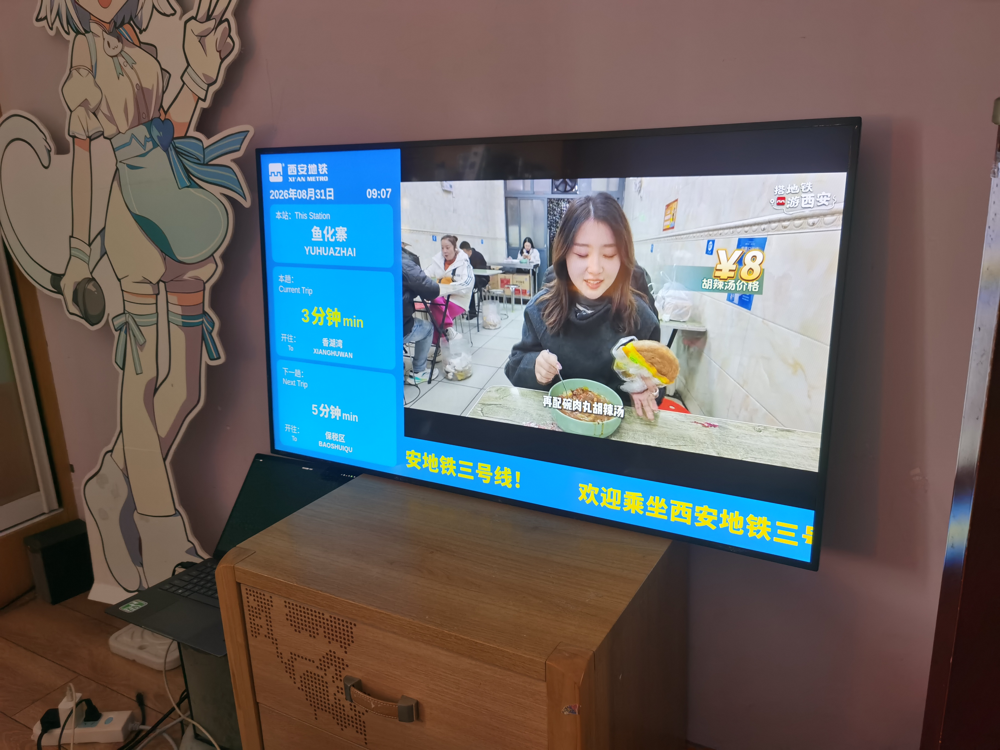
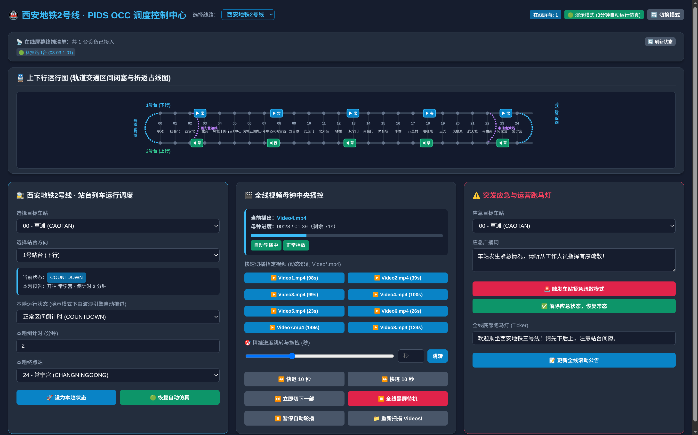
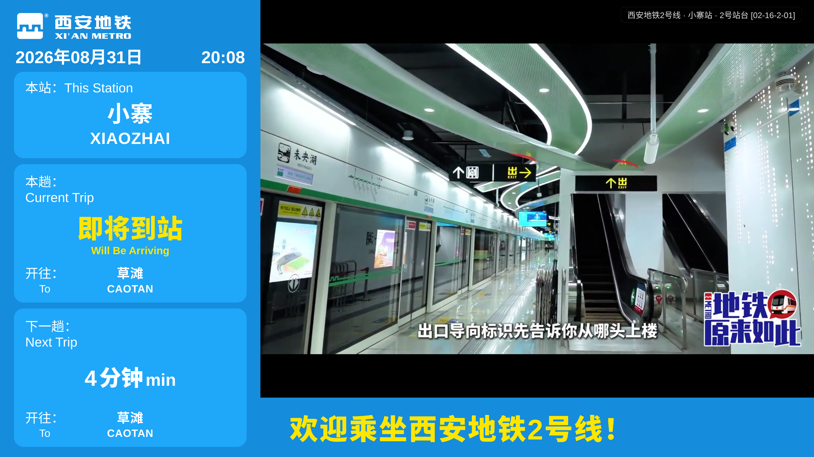

# 🚇 Xi'an Metro PIDS (Passenger Information Display System) & OCC Central Server
### 西安地铁站台乘客信息系统 (PIDS) 仿真系统与 OCC 集中调度控制中心

[](https://www.python.org/)
[](https://fastapi.tiangolo.com/)
[](https://developer.mozilla.org/en-US/docs/Web/API/WebSockets_API)
[](https://www.xianrail.com/)

一个高拟真度、全动态、工业级架构的**西安地铁站台乘客信息系统**与 **OCC 调度中心集中播控平台**。严格遵循西安地铁官方视觉规范、最新站名更名标准与大中小交路套跑运行图。

---

## 🖼️ 效果演示

| 站台 PIDS 屏幕效果 |
| :---: |
|  |

| OCC 调度控制中心后台 | 站台 PIDS 截图效果 |
| :---: | :---: |
|  |  |

---

## ✨ 核心特性

- 🚉 **100% 还原西安地铁官方站台 PIDS 界面**：
  - 侧边栏列车到站预告（本趟/下一趟车次、到站倒计时、即将到站、列车到站、不停靠状态）；
  - 顶部西安地铁官方 SVG Logo 标识；
  - 严格遵循**西安地铁官方站名规范**（采用全大写无声调拼音无空格分词，包含 2 号线最新更名站：凤城十路、青少年中心、八里村、电视塔）；
  - 底部跑马灯滚动公告字幕（支持 OCC 实时推送更新）；
  - 右侧中央高清视频多媒体播放区（等比自适应黑边排版）。
- ⏱️ **全线视频母钟中央精准同步 (Video Master Clock)**：
  - OCC 后端维护统一微秒级母钟，全线成百上千块站台屏幕毫秒级帧同步；
  - 动态扫描 `Videos/Video*.mp4` 媒体库，自动解析视频时长与切片轮播；
  - 支持 OCC 一键切片、精准秒级拖拽快进/快退、全线黑屏待机。
- 🔄 **动态线路配置解耦 (`lines/*.json`)**：
  - 车站拓扑、站台数量、行车发车间隔（Headway）、区间运行耗时、折返时间、交路配置 100% JSON 配置化；
  - 支持任意新线路（如 1、4、5、6、9、14、16号线等）即插即用热加载；
  - 多线路并发仿真引擎，屏幕根据 URL 参数精准隔离渲染。
- 🚄 **真实运行图与双向大小交路套跑仿真 (Wave Signaling Engine)**：
  - **2 号线**：南向「常宁宫 (大交路) : 韦曲南 (小交路) = 4:1」、北向「草滩 (大交路) : 西安北站 (小交路) = 4:1」双向渡线折返套跑；
  - **3 号线**：东向「保税区 (大交路) : 香湖湾 (小交路) = 2:1」渡线折返套跑；
  - 自动模拟全线闭塞区间、进站放行、折返占线与波浪式列车推进。
- 🎛️ **OCC 调度控制中心 (`/control`)**：
  - 实时 SVG 动态全线轨道占线图（上下行双向轨道、各站渡线折返、车辆实时动态跟踪）；
  - 线路热切换器；
  - 站台人工调度（本趟状态一键下发、设为不停靠、自动过站恢复倒计时、一键恢复自动时刻表）；
  - 车站紧急广播模式（火灾/疏散/应急状态红色全屏警报推送）；
  - 优雅非阻塞 Toast 消息提示，零弹窗干扰。

---

## 📂 项目结构

```text
MetroPIS/
├── Demo/                   # 效果展示图片
│   ├── Demo1.png
│   ├── Demo2.jpg
│   └── BackendDemo.png
├── lines/                  # 线路拓扑与运行图配置库 (JSON)
│   ├── 2.json              # 西安地铁 2 号线 (草滩 ↔ 常宁宫, 含韦曲南/西安北站交路)
│   └── 3.json              # 西安地铁 3 号线 (鱼化寨 ↔ 保税区, 含香湖湾交路)
├── Videos/                 # PIDS 多媒体视频库 (自动扫描 Video*.mp4)
│   ├── Video1.mp4
│   └── ...
├── index.html              # 站台 PIDS 屏幕前端 (纯原生 HTML5/CSS3/WebSocket, 零外部依赖)
├── server.py               # FastAPI 中心 OCC 调度服务器 / WebSocket 总线 / 视频母钟
├── screen_config.json      # 独立终端屏幕离线配置示例
├── requirements.txt        # Python 依赖清单
├── .gitignore              # Git 忽略配置
├── LICENSE                 # AGPL-3.0 开源许可证
└── README.md               # 项目使用说明文档
```

---

## 🚀 快速上手

### 1. 安装依赖

确保系统已安装 Python 3.9+，在项目根目录下安装依赖：

```bash
pip install -r requirements.txt
```

### 2. 启动中央 OCC 服务器

```bash
python3 server.py
```

服务器启动后，默认监听在 `http://0.0.0.0:8080`：
- **PIS 站台屏幕前端**：`http://localhost:8080/`
- **OCC 调度控制中心**：`http://localhost:8080/control`

---

## 📺 站台屏幕访问参数说明

站台屏幕支持通过 URL Query 参数指定线路、车站、站台与屏幕编号：

```text
http://localhost:8080/?line=<线路ID>&station=<车站ID>&platform=<站台号>&screen=<屏幕编号>
```

### 常用示例：
- **3 号线 · 小寨站 1 号站台 (开往 保税区/香湖湾)**：
  `http://localhost:8080/?line=3&station=6&platform=1&screen=1`
- **3 号线 · 小寨站 2 号站台 (开往 鱼化寨)**：
  `http://localhost:8080/?line=3&station=6&platform=2&screen=1`
- **2 号线 · 小寨站 1 号站台 (开往 常宁宫/韦曲南)**：
  `http://localhost:8080/?line=2&station=16&platform=1&screen=1`
- **2 号线 · 小寨站 2 号站台 (开往 草滩/西安北站)**：
  `http://localhost:8080/?line=2&station=16&platform=2&screen=1`
- **2 号线 · 钟楼站 1 号站台 (ZHONGLOU)**：
  `http://localhost:8080/?line=2&station=12&platform=1&screen=1`

---

## 🛠️ 添加自定义新线路

在 `lines/` 目录下新建 `{line_id}.json`（例如 `lines/4.json`），系统启动或热重载时会自动识别并加入线路列表：

```json
{
  "line_id": 4,
  "name_cn": "西安地铁4号线",
  "name_en": "Xi'an Metro Line 4",
  "color": "#00a88f",
  "headway_sec": 180,
  "station_interval_sec": 35,
  "turnaround_dur_sec": 35,
  "stop_time_sec": 20,
  "routing_pattern": {
    "down_sequence": [28, 28, 28],
    "up_sequence": [0, 0, 0],
    "start_terminal": 0,
    "full_turn_terminal": 28,
    "short_turn_terminal": 28
  },
  "stations": [
    {"id": 0, "cn": "西安北站", "en": "XI'AN BEIZHAN", "short": "西安北", "has_turnaround_loop": true},
    {"id": 1, "cn": "元朔路", "en": "YUANSHUOLU", "short": "元朔路"},
    ...
  ]
}
```

---

## 📜 许可证

本项目基于 AGPL 许可证开源。仅供轨道交通爱好者、交通仿真研究与教学使用。
